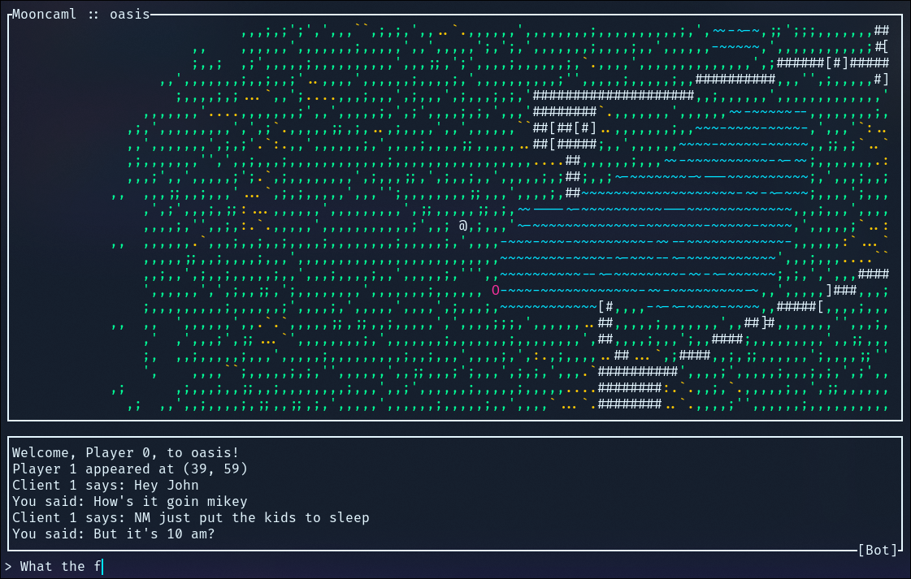

# 🐫oon🌜aml
<small>(mooncaml)</small>

A Moonlapse MUD server and terminal client implementation in OCaml.



# Dependencies

- A Unix OS (Windows not currently supported, but WSL should work fine)
- [OCaml](https://ocaml.org/install#linux_mac_bsd) 5.4.0 or later


# Quick start

## 1. Obtain the source
Depending on what you want to do, you gotta clone the repo first and set up a local OPAM switch to keep your environment clean:

```shell
git clone [https://github.com/tristanbatchler/mooncaml](https://github.com/tristanbatchler/mooncaml)
cd mooncaml
opam switch create . --no-install
eval $(opam env)
```


## 2. Install dependencies

Choose whichever scenario sounds like you.

### I'm a player wanting to connect to a hosted server

Installs only what is required to connect to a server and play the game.

```shell
opam install ./mooncaml_client.opam ./mooncaml_shared.opam --deps-only
```


### I'm a server admin wanting to host a game world

Installs only what is required to host the game world. 

```shell
opam install ./mooncaml_server.opam ./mooncaml_shared.opam --deps-only
```


### I'm a developer wanting to work on both the client and server

Install all dependencies for the client and server, plus development tools like the LSP, formatter, and debugger.

```shell
opam install . --deps-only --with-dev-setup
```


## 3. Compile and Run

Depending on what you installed, you can boot up the respective applications using Dune:

**To run the server:**

```shell
dune exec server_app

```

**To run the client:**

```shell
dune exec client_app

```
